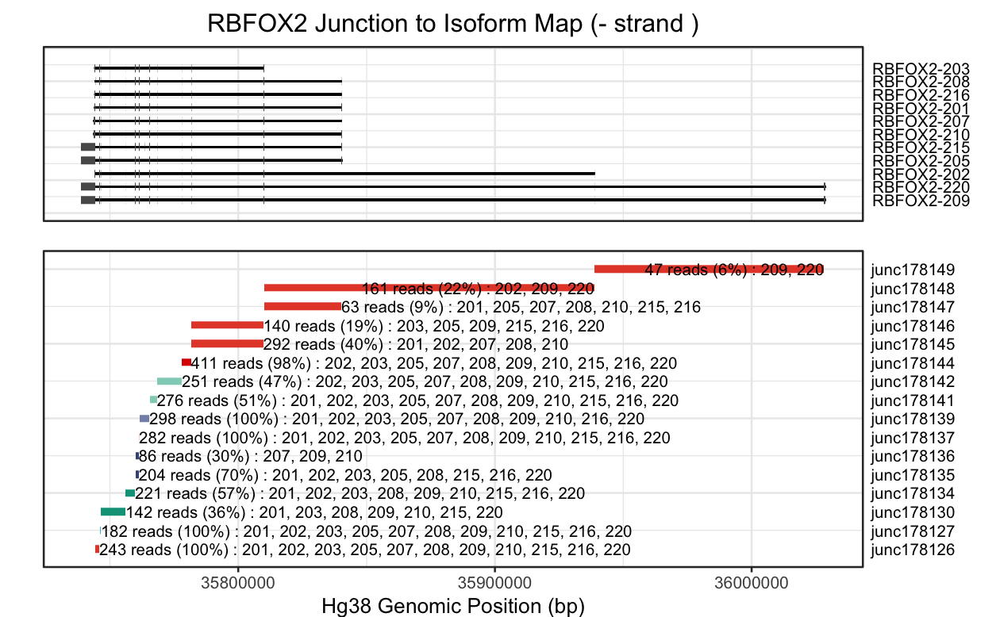
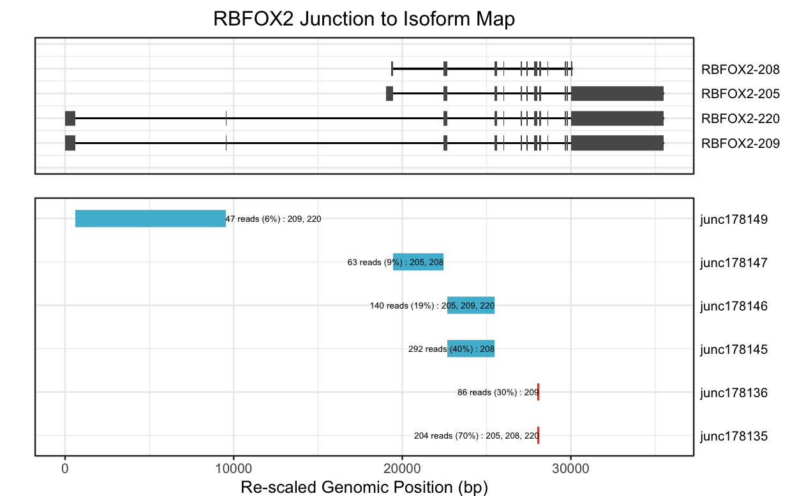

# Isoviz 

<!-- badges: start -->

[](https://img.shields.io/github/issues/daklab/isoviz/issues) [](https://travis-ci.com/karini925/isoviz)

<!-- badges: end -->

The goal of isoviz is to simplify designing isoform-centric experiments, especially CRISPR-based ones.

We are actively working to make improvements for Isoviz, so please let us know what features would be helpful. 

## Installation

Note, the package has thus far been tested under R version 4.3.0. Before installing, please start a new R session to clear any pre-loaded packages that may interfere. 

You can install the development version of isoviz from [GitHub](https://github.com/) with:

``` r
# install.packages("devtools")
devtools::install_github("daklab/isoviz")
```

Alternatively, you can do the following:

``` r
# 1. git clone https://github.com/daklab/isoviz.git
# 2. set the directory in which isoviz is cloned into as your working directory, then do the following:
library(devtools)
devtools::build()
devtools::install()
library(isoviz)
```

## Introduction

Our package aims to help quantify and visualize the transcript isoforms that are present in your samples. The figure below depicts isoviz's workflow as well as the required inputs and expected outputs.

There are a few initial decisions to make, depending on what RNA sequencing data you already have available:
1. If you have long read RNA-sequencing data for your cell type of interest, we recommend using that data to generate a psl or gtf file of expressed isoforms as input for isoviz_coords(). Otherwise, you can use the GENCODE v41 basic annotations psl that we have pre-loaded.
2. If you have Illumina short read RNA-sequencing data for your cell type of interest, we recommend using that data to generate a regtools junction count file for input into isoviz_minicutter(). Otherwise, you can choose from our pre-loaded cell line data. Currently, we include HUES66 human embryonic stem cells, HEK293, and A375, but hope to add more soon.
3. The remaining functions are gene and junction specific, requiring a gene name or Ensembl ID as input. Isoviz plots transcript structures of a given gene and integrates junction level coordinates and counts obtained with Regtools with isoforms. You can choose to visualize only the transcript isoforms that are detected in your sample and see how they group into leafuctter intron clusters.


## Example

#### Step 1: Generate exon and intron coordinate tables

We start off by loading all our exon and intron coordinates. By default, this will use 'gencode.v41.basic annotation' data (see below). 

``` r
library(isoviz)

## default input file
file_path <- system.file("data", "gencode.v41.basic.annotation.psl", package="isoviz")
gene_trans <- system.file("data", "gencode_v41_gene_transcript_convert.txt", package="isoviz")

all_coordinates <- isoviz_coords(file_path, gene_trans, input_type="psl") #use default genome .psl file  
```

Alternatively, you can also input your own psl or gtf file (either from another GENCODE version or from a long read RNA-sequencing experiment).

``` r
library(isoviz)

## custom input file
file_path <- "/path_to_annotation_file/annotation.psl"
gene_trans <- system.file("data", "gencode_v41_gene_transcript_convert.txt", package="isoviz")

all_coordinates <- isoviz_coords(file_path, gene_trans, input_type="psl") # change input_type to gtf if using gtf format 
```

Let's look at the exon coordinates

``` r
exon_coords <- all_coordinates[[1]]
```

Let's look at the intron coordinates

``` r
intron_coords <- all_coordinates[[2]]
```

#### Step 2: Leafcutter clustering using cell type specific junction count data

We will first need to load our leafcutter junctions that we obtained by running Regtools extract junctions on our BAM files. You can use one of our preloaded cell types or first run this on your own BAM file and then use as input for this function. We will look at junctions in hESC data. We will first need to run 'minicutter' to cluster the junction coordinates and obtain intron cluster events. Note, some of these clusters will only contain one junction (singleton). You will have the option to change this when running isoviz_minicutter.

``` r

# load junctions for cell type of interest or input your own
# replace with junctions <- "path/file.junc" to read in your own input
junctions <- system.file("data", "21c_hESC_RB2_empty_v41_basic.junc", package="isoviz")

# run minicutter to get clusters 
intron_clusts <- isoviz_minicutter(juncs_file = junctions)
```

We have additional pre-loaded junction and isoform information here:

``` r
# For now we will use the expanded intron dataset with additional annotations by Megan 
# We will need an additional function to add these annotations 
intron_annotations <- system.file("data", "gencode_intron_all_data.rda", package="isoviz")
load(intron_annotations)
```

#### Step 3: Plotting isoforms and junction and cluster information

This is where you need to select a gene; we will look at RBFOX2. This is where we integrate the isoform-level information from Step 1 with the junction-level information from Step 2. To do this, we will use the `isoviz_map_junctions` function. 

``` r
gene = "RBFOX2"
gene_exons <- filter(exon_coords, gene_name == gene) # exon_coords from Step 1
gene_introns <- filter(intron_coords, gene_name == gene) # intron_coords from Step 1

# intron_clusts and gencode_intron_all_data from Step 2
mapped_junctions = isoviz_map_junctions(cell_type = "hESC", gene_introns, intron_clusts, gencode_intron_all_data) 

```

Now we are ready to make a plot! You can choose to scale introns or not. If you choose not to scale introns, the x-axis will be in genome coordinates and therefore will be flipped for negatively stranded gene. Please pay attention to strand! Additionally, default settings will plot all isoforms and junctions.

``` r
isoviz_plot_juncs_to_iso(mapped_junctions, gene_exons, gene_introns,
                                    cell_type = "hESC",
                                    junc_usage = 5, #min junc usage to be included 
                                    intron_scale = "no")
```



We would recommend scaling introns, where the x-axis will be in transcript coordinates and will always be plotted starting with the TSS, no matter the strand. This is much easier to interpret.

``` r

isoviz_plot_juncs_to_iso(mapped_junctions, gene_exons, gene_introns,
                                    cell_type = "hESC",
                                    junc_usage = 5, #min junc usage to be included 
                                    intron_scale = "yes", intron_scale_width = 10)
```


You can also specify specific isoforms and/or junctions that you want to visualize.

``` r

isoviz_plot_juncs_to_iso(mapped_junctions, gene_exons, gene_introns,
                                    cell_type = "hESC",
                                    junc_usage = 5, #min junc usage to be included 
                                    intron_scale = "yes", intron_scale_width = 10,
                                    include_specific_isoforms = c("RBFOX2-209", "RBFOX2-220", "RBFOX2-208", "RBFOX2-205"),
                                    include_specific_junctions = c("junc178147", "junc178149", "junc178135", "junc178136", "junc178145", "junc178146"))
                                    
```



#### Step 4: Obtain junction gRNA efficiency predictions (TIGER model) for a specific gene and junction.

We have a table of TIGER predictions pre-loaded for all junctions in GENCODE v41 basic annotations. If a junction gRNA is missing, it is likely that gRNA does not have a unique sequence or has homopolymers (runs of C's, G's, T's or A's) and you should not use it. For junctions not present in GENCODE v41 or for designing gRNAs to exons, you can get TIGER predictions at tiger.nygenome.org (Wessels and Stirn et al. 2023). 

To interpret TIGER scores based on expected gRNA efficiency, you can refer to Figure 5 of our manuscript. In our experience, for single gene experiments, we recommend trying the top two predicted gRNAs per junction. In our group, we consider gRNAs with score > 0.2 to be likely active. 

``` r
guide_table = isoviz_get_guide_predictions(gene = "ENSG00000100320", leafcutter_input=intron_clusts,
                                              guides_per_junction = 5,
                                              include_specific_junctions = c("junc178147", "junc178149", "junc178135", "junc178136", "junc178145", "junc178146"),
                                              output_format="nice_table")

guide_table
```


## Citation

``` r
citation("isoviz")
#> 
#> To cite package ‘isoviz’ in publications use:
#>
#>  Isaev K, Schertzer M (2023). _isoviz: Visualize transcript isoforms alongside exon-exon junction counts_. R package version 0.1.0.
#>
#> A BibTeX entry for LaTeX users is
#>
#>  @Manual{,
#>    title = {isoviz: Visualize transcript isoforms alongside exon-exon junction counts},
#>    author = {Karin Isaev and Megan Schertzer},
#>    year = {2023},
#>    note = {R package version 0.1.0},
#>  }
```

## Questions or suggestions?
