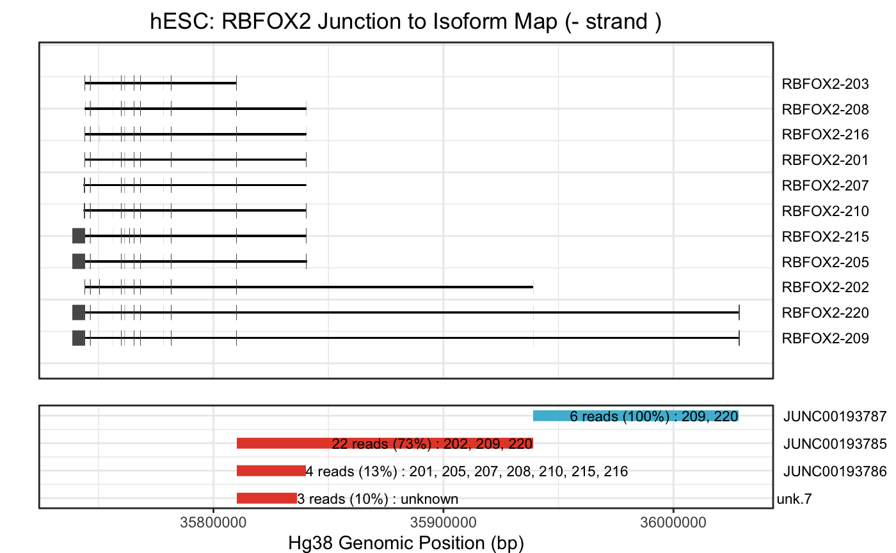

# isoviz 

<!-- badges: start -->

[](https://img.shields.io/github/issues/daklab/isoviz/issues) [](https://travis-ci.com/karini925/isoviz)

<!-- badges: end -->

`isoviz` is a package that allows for simplified transcript isoforms visualizations.

The goal of isoviz is to simplify working with trancsript isoforms. Given a gene name or Ensembl ID, you can visualize all transcript structures. Additionally, Isoviz integrates with junction coordinates and counts obtained with Regtools. You can choose to visualize only the transcript isoforms that are detected in your sample and see how they group into leafuctter intron clusters.

## Installation

You can install the development version of isoviz from [GitHub](https://github.com/) with:

``` r
# install.packages("devtools")
devtools::install_github("daklab/isoviz")
```

## Introduction

Our package aims to help quantify and visualize the transcript isoforms that are present in your samples.

## Example

We start off by loading all our exon and intron coordinates. By default, this will use 'gencode.v41.basic annotation' data. You can also input your own psl file (gtf file as well in the future).

``` r
library(isoviz)

## basic example code
file_path <- system.file("data", "gencode.v41.basic.annotation.psl", package="isoviz")
gene_trans <- system.file("data", "gencode_v41_gene_transcript_convert.txt", package="isoviz")

all_coordinates <- isoviz_coords(file_path, gene_trans, input_type="psl") #use default genome .psl file  
```

#### Let's look at the exon coordinates

```{r}
exon_coords <- all_coordinates[[1]]
print(head(exon_coords))
```

#### Let's look at the intron coordinates

```{r}
intron_coords <- all_coordinates[[2]]
print(head(intron_coords))
```

#### Let's make a basic plot of the isoforms for the gene RBFOX2

```{r}
# get exons and introns 
rbfox2_exons <- filter(exon_coords, gene_name == "RBFOX2")
rbfox2_introns <- filter(intron_coords, gene_name == "RBFOX2")
```

#### Intron re-scaling

Let's rescale the intron coordinates but keep the relative exon alignments this step will return an updated dataframe of exon coordinates that we can use with our plotting function.

```{r}
rescaled_coords = isoviz_rescale_introns(rbfox2_introns, rbfox2_exons, width_rescale=10) 
```

#### Intron clustering using junction count data from BAM files

We will first need to load our leafcutter junctions that we obtained by running Regtools extract junctions on our BAM files. You can use one of our preloaded cell types or first run this on your own BAM file and then use as input for this function. We will look at junctions in hESC data. We will first need to run 'minicutter' to cluster the junction coordinates and obtain intron cluster events.

```{r}

# load junctions for cell type of interest or input your own
junctions <- system.file("data", "hESC-MKNK2-G1_v41_basic.junc", package="isoviz")

# run minicutter to get clusters 
intron_clusts <- isoviz_minicutter(juncs_file = junctions)
print(head(intron_clusts))
```

Let's take a look at how junctions were grouped into intron clusters. Note, some of these clusters will only contain one junction (singleton). You will have the option to change this when running isoviz_minicutter.

```{r}
# For now we will use the expanded intron dataset with additional annotations by Megan 
# We will need an additional function to add these annotations 
intron_annotations <- system.file("data", "gencode_intron_all_data.rda", package="isoviz")
load(intron_annotations)
```

#### Plotting isoforms and junction and cluster information

Let's continue working on RBFOX2. Now we have to map the observed junctions with their corresponding exons and transcript isoforms. To do this, we will use the `isoviz_map_junctions` function. Make sure to check strand of gene!

```{r}
mapped_junctions = isoviz_map_junctions(cell_type = "hESC", rbfox2_introns, intron_clusts, gencode_intron_all_data)
print(head(mapped_junctions))
```

Now we are ready to make a plot!

```{r}
isoviz_plot_juncs_to_iso(mapped_junctions, rbfox2_exons, rbfox2_introns,
                         cell_type = "hESC",
                         junc_usage = 5, #min junc usage to be included
                         include_all_juncs = FALSE,
                         include_specific_junctions = c("junc178149",
                                                        "junc178148",
                                                        "junc178145"))
```



## Citation

``` r
citation("isoviz")
#> 
#> To cite package ‘isoviz’ in publications use:
#>
#>  Isaev K, Schertzer M (2023). _isoviz: Visualize transcript isoforms alongside exon-exon junction counts_. R package version 0.1.0.
#>
#> A BibTeX entry for LaTeX users is
#>
#>  @Manual{,
#>    title = {isoviz: Visualize transcript isoforms alongside exon-exon junction counts},
#>    author = {Karin Isaev and Megan Schertzer},
#>    year = {2023},
#>    note = {R package version 0.1.0},
#>  }
```

## Questions or suggestions?
